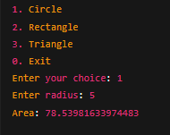
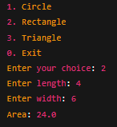

                 

# 🔷 Java Shape Area Calculator

A simple **console-based Shape Area Calculator** built in Java.  
This is my **Day 4 project** from Phase One of learning Java basics.

---

## 🚀 Features
- Calculate area of different shapes:
  - Circle
  - Rectangle
  - Triangle
- Uses **Inheritance** for Shape hierarchy
- Uses **Method Overriding** for area calculation
- Demonstrates **Polymorphism** at runtime
- Menu-driven console program

---

## 📂 Project Structure
Shape-Area-Calculator/
├── ShapeAreaCalculator.java
└── README.md
